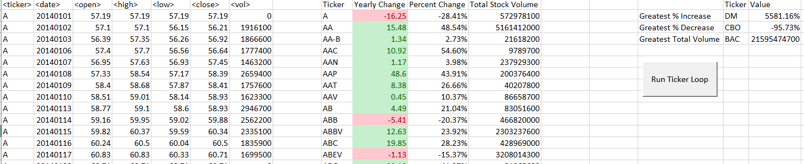
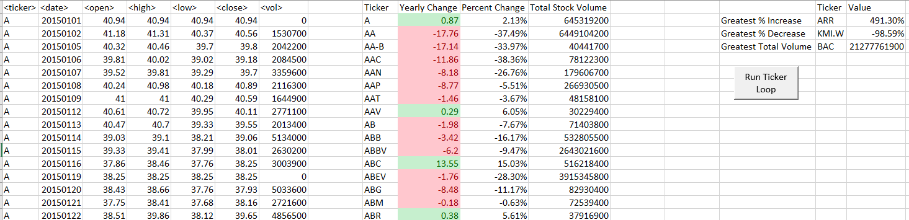
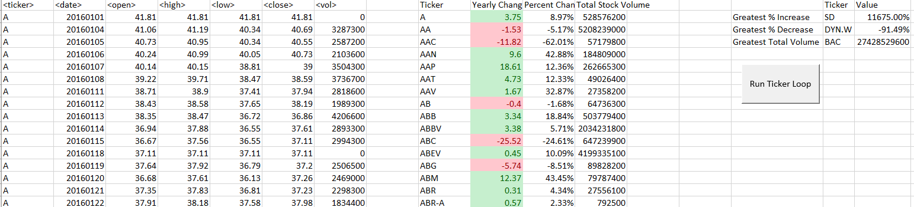

# The VBA of Wall Street

### Stock market analyst

## My Data Results

* Create a script that will loop through all the stocks for one year and output the following information.

  * The ticker symbol.

  * Yearly change from opening price at the beginning of a given year to the closing price at the end of that year.

  * The percent change from opening price at the beginning of a given year to the closing price at the end of that year.

  * The total stock volume of the stock.

  * Conditional formatting that will highlight positive change in green and negative change in red.

### CHALLENGES

1. Create a script to return the stock with the "Greatest % increase", "Greatest % decrease" and "Greatest total volume". The solution will look as follows:

2. VBA script will run on every worksheet, i.e., every year.

### 2014 Ticker Analysis:

### 2015 Ticker Analysis:

### 2016 Ticker Analysis:

